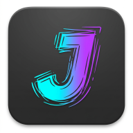



  
  <h1>JitterFX</h1>
  
<strong>Motor WebGL de Animación (Jitter / Hand-drawn) para Artistas Digitales</strong>

  

 

JitterFX es una aplicación web de procesamiento de imágenes del lado del cliente (PWA). Permite a ilustradores y fotógrafos cargar imágenes estáticas y generar bucles animados con efecto de "temblor" o trazado a mano, ideales para proteger obras en redes sociales como Twitter (X).

## 🚀 Acceso Inmediato

**No necesitas descargar, clonar ni compilar este repositorio.**  
Para usar la herramienta, simplemente haz clic en el siguiente enlace desde tu PC o teléfono móvil:

👉 **[ABRIR JITTERFX AHORA](https://tolgrim-arch.github.io/TOLGRIM-JitterFX/)**

*(Opcional: Si abres el enlace en tu móvil, el navegador te sugerirá añadirla a la pantalla de inicio. Si lo haces, funcionará como una app nativa sin conexión a internet).*

---

## 🎨 Características Principales

Esta herramienta fue diseñada para eludir las agresivas compresiones de Twitter (X) y proteger el trabajo de los creadores:

- **Múltiples Algoritmos de Jitter:** Global Shift, Bloques Corruptos, Ruido Estático, Ondulación de Malla, y Deformación Suave (*Value Noise*).
- **Exportación Dual (GIF y WebM):** 
  - Genera GIFs tradicionales.
  - Exporta en WebM para preservar **Transparencia Alfa** con bordes anti-aliasing perfectos (Twitter los acepta de forma nativa).
- **Fondo Matte Integrado:** Si usas GIF, puedes inyectar colores de fondo específicos (Twitter Dark, Dim, Light) para evitar que la red social destroce los bordes de tu ilustración con un fondo negro forzado.
- **Marca de Agua Anti-Robo:** Introduce tu firma o @usuario, y JitterFX lo fusionará en la esquina de la animación con contraste adaptativo, haciendo imposible robar la imagen fácilmente.
- **Bucle Ping-Pong:** Asegura que la animación fluya hacia adelante y hacia atrás para que no haya saltos bruscos al reiniciarse el loop.

## 🛠️ Detalles Técnicos

- **Core:** HTML5, CSS3, JavaScript Vanilla.
- **Motor Gráfico:** WebGL para shaders de fragmento (aceleración por GPU en el navegador).
- **Exportación:** `gif.js` para renderizado de buffers por Web Workers y `MediaRecorder` nativo para WebM (VP9/H264).
- **Arquitectura:** Progressive Web App (PWA) con Service Workers para ejecución 100% Offline.
